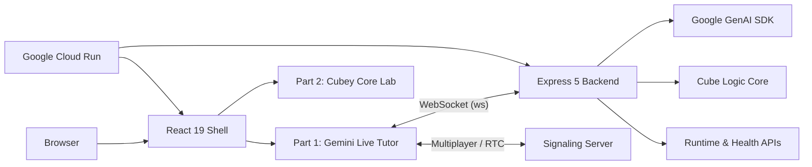

# AI Rubik's Tutor 2026

<div align="center">
  
  <h3>The future of 3D cognitive training, powered by Gemini 2.x Live.</h3>
  
  [](https://vitejs.dev)
  [](https://react.dev)
  [](https://tailwindcss.com)
  [](https://cloud.google.com/run)
  [](https://deepmind.google/technologies/gemini/)
</div>

---

<p align="center">
  <strong>A high-performance Rubik's Cube monorepo architecture. One integrated surface for AI coaching and deterministic logic.</strong>
</p>

## 🚀 One Repo. Two Experiences.

> [!NOTE]
> AI Rubik's Tutor is a unified 2026 workspace that bridges high-level AI coaching with low-level deterministic logic. It's built around **one modern frontend system** and **one Cloud Run backend**.

### 🎙️ Part 1: Gemini Live Tutor
**Realtime 3x3 coaching with voice, vision, and memory.**
A realtime 3x3 coaching engine. It sees your physical cube via webcam, listens to your questions, and guides you to victory with voice, move-specific hints, and a shared 3D stage.
- **Routes:** `/`, `/part-1`, `/part-1/live`, `/part-1/multiplayer`.
- **Core:** [LiveSession.jsx](frontend/src/components/LiveSession.jsx) • [geminiLiveClient.js](backend/src/geminiLiveClient.js)

### 🧪 Part 2: Cubey Core 2x2 Lab
**Deterministic cube logic and exact solving search.**
A standalone 2x2 solver with one shared cube-state logic, manual controls, and exact BFS, A*, and IDA* playback on a shared 24-sticker state model.
- **Routes:** `/part-2`, `/legacy-2x2-solver/index.html`.
- **Core:** [cube-core.js](frontend/public/legacy-2x2-solver/cube-core.js) • [solver.js](frontend/public/legacy-2x2-solver/solver.js)

---

## 🏗️ Technical Architecture

AI Rubik's Tutor uses a **Single-Origin Deployment** model. The frontend is compiled into production chunks and served directly by the Express backend, ensuring zero CORS friction in production.



---

## 📁 Repository Blueprint

```text
.
├── backend/            # Express backend, Gemini integration, runtime APIs
├── frontend/           # React product shell & static assets
│   ├── public/         # Part 2 legacy assets
│   └── src/            # Part 1 product source
├── scripts/            # Unified developer entrypoints
├── Dockerfile          # Integrated multi-stage production build
├── cloudbuild.yaml     # CI/CD rollout pipeline
└── deploy.sh           # Manual deployment automation
```

---

## 🚦 Local Developer Guide

### 1. Setup & Dependencies
```bash
npm ci --prefix backend
npm ci --prefix frontend
cp .env.example .env
```

### 2. Environment Configuration
**Minimum Required Settings:**
```bash
PORT=8080
GEMINI_API_KEY=YOUR_KEY
GEMINI_LIVE_MODEL=gemini-live-2.5-flash-preview
VITE_BACKEND_ORIGIN=http://localhost:8080
```

### 3. Execution
| Command | Mode | Target |
| :--- | :--- | :--- |
| `./scripts/start-gemini.sh` | **Full** | Starts Backend (8080) & Frontend (5173) |
| `./scripts/start-core.sh` | **Frontend** | Starts only the visual workspace |

---

## 🛳️ Deployment & CI/CD

The project is optimized for **Google Cloud Platform**. The entire repo ships as a single integrated container.

### Manual Rollout
```bash
./deploy.sh <YOUR_GCP_PROJECT_ID>
```

**Under the Hood:**
1.  **Build Stage**: Vite compiles optimized React 19 chunks.
2.  **Bundle Stage**: Assets are mapped into the Express 5 runtime.
3.  **Deploy Stage**: Image is pushed to Artifact Registry & rolled out to Cloud Run.
4.  **Health Check**: Real-time smoke tests verify `/health` and `/api/runtime`.

---

## 🎖️ Active Product Links

| Context | URL |
| :--- | :--- |
| **Production Root** | [Launch App](https://gemini-rubiks-tutor-vnc62azkwq-uc.a.run.app/) |
| **Gemini Live** | [Start Tutor](https://gemini-rubiks-tutor-vnc62azkwq-uc.a.run.app/part-1/live) |
| **2x2 Lab** | [Open Lab](https://gemini-rubiks-tutor-vnc62azkwq-uc.a.run.app/part-2) |
| **System Sync** | [/api/runtime](https://gemini-rubiks-tutor-vnc62azkwq-uc.a.run.app/api/runtime) |

---

<p align="center">
  Designed and Engineered by <b>Mangesh Raut</b>
</p>
