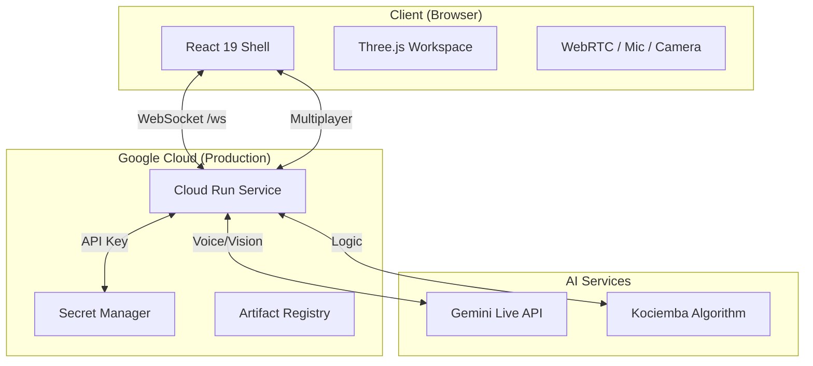

# AI Rubik's Tutor 2026

<div align="center">
  
  <h3>The future of 3D cognitive training, powered by Gemini 2.x Live.</h3>
  
  [](https://vitejs.dev)
  [](https://react.dev)
  [](https://tailwindcss.com)
  [](https://cloud.google.com/run)
  [](https://deepmind.google/technologies/gemini/)
</div>

---

## 🚀 One Repo. Two Intelligent Worlds.

AI Rubik's Tutor is a unified 2026 workspace that bridges high-level AI coaching with low-level deterministic logic. It's not just a solver; it's a **cognitive partner**.

### 🎙️ [Part 1: Gemini Live Tutor](/#part-1)
> **Coaching through companionship.**
> A realtime 3x3 coaching engine. It sees your physical cube via webcam, listens to your questions, and guides you to victory with voice, move-specific hints, and a shared 3D stage.
- **Vibe:** Realtime • Human-centric • Multi-modal.
- **Routes:** `/`, `/live`, `/multiplayer`.

### 🧪 [Part 2: Cubey Core Lab](/#part-2)
> **The science of the solve.**
> A deterministic 2x2 lab built on a shared 24-sticker state model. It handles the heavy lifting of BFS, A*, and IDA* algorithms with exact frame-by-frame solve playback.
- **Vibe:** Exact • Explorable • Algorithmic.
- **Routes:** `/part-2`, `/legacy-solver/index.html`.

---

## ✨ 2026 Feature Deck

| Feature | Description | Tech |
| :--- | :--- | :--- |
| **Multimodal Vision** | Realtime webcam frame analysis to verify physical cube state. | Gemini 2.x Flash + Canvas |
| **Voice Interruption** | Seamlessly "barge in" during tutor guidance. | WebRTC + PCM Audio |
| **Multiplayer Racing** | P2P Rubik's Cube races with shared scramble state. | WebRTC Signaling Server |
| **Unified UI** | A premium "Glassmorphic" interface across both parts. | Tailwind 4 + Framer Motion |

---

## 🛠️ The 2026 Tech Stack

### Frontend Architecture
- **Framework:** React 19 (Concurrent Rendering)
- **Tooling:** Vite 7 (Instant HMR)
- **Styling:** Tailwind CSS 4 (Modern CSS Engine)
- **3D Engine:** Three.js 0.183 (Physical Material Render)
- **State:** Zustand 5 (Persistent Storage)

### Backend Services
- **Runtime:** Node.js 22 (LTS)
- **Core:** Express 5 (Asynchronous Logic)
- **AI Integration:** Google GenAI SDK (`gemini-live-2.5-flash-preview`)
- **Transport:** WebSocket (`ws`) for low-latency feedback.

---

## 🏗️ Technical Architecture



---

## 🚦 Getting Started

### 1. Installation
```bash
npm ci --prefix backend
npm ci --prefix frontend
```

### 2. Environment Setup
Create a `.env` in the root (use `.env.example` as a template):
```env
GEMINI_API_KEY=AIza...
VITE_BACKEND_ORIGIN=http://localhost:8080
DEMO_MODE=false
```

### 3. Launch the Experience
```bash
# Start both Backend & Frontend in one go
./scripts/start-gemini.sh
```
Explore the workspace at `http://localhost:5173`.

---

## 📦 Deployment & Cloud Native

This project is optimized for **Google Cloud Platform**. The entire repo ships as a single integrated container.

```bash
# Deploy instantly to Cloud Run
./deploy.sh <PROJECT_ID>
```

**What happens under the hood:**
- Build system compiles React 19 optimized chunks.
- Docker multi-stage build bundles assets into an Express 5 runtime.
- Automated secret wiring via Secret Manager.
- Real-time smoke tests verify health and runtime stability.

---

## 🎖️ Devpost Submission Pack
Everything for the **Gemini Live Agent Challenge 2026** is pre-packaged:
- **Project Docs:** [`/submission/devpost-2026/`](/submission/devpost-2026/)
- **Health:** [`/health`](https://gemini-rubiks-tutor-906543212291.us-central1.run.app/health)
- **Architecture:** `docs/ARCHITECTURE.md`

---

<div align="center">
  <p>Made with ❤️ for the Gemini Live Agent Challenge 2026</p>
  <b>Author: Mangesh Raut</b>
</div>
