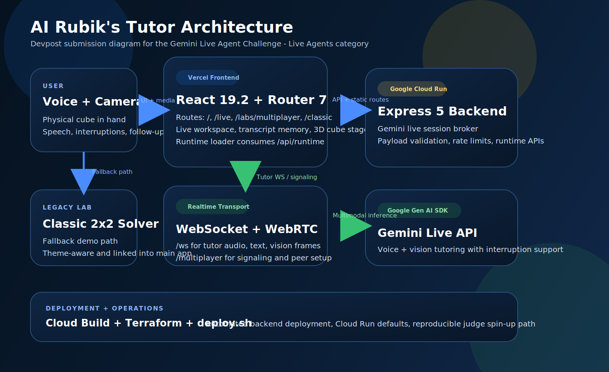

# AI Rubik's Tutor

AI Rubik's Tutor is a Gemini Live Agent Challenge project built as a single repo with two cube products:

1. A real-time **3x3 Gemini tutor** with voice, vision, live coaching, session memory, and multiplayer.
2. A polished **2x2 classic solver lab** with deterministic search algorithms and a shared modern visual system.

The repo is organized so both surfaces feel like one product family instead of a main app plus an abandoned side demo.

## Projects In This Repo

### 1. Gemini Live Tutor

- Location: `frontend/` + `backend/`
- Purpose: live Rubik's Cube coaching with Gemini, webcam frames, transcript memory, guided moves, hints, auto-solve, and multiplayer
- Frontend routes:
  ` /`
  ` /live`
  ` /labs/multiplayer`
  ` /classic`
- Backend surfaces:
  ` /health`
  ` /api/health`
  ` /api/runtime`
  ` /ws`
  ` /multiplayer`

### 2. Cubey Core 2x2 Lab

- Location: `frontend/public/legacy-2x2-solver/`
- Purpose: standalone 2x2 solver workspace with BFS, A*, and IDA*
- Entry point:
  ` /legacy-2x2-solver/index.html`
- Notes:
  It now uses one shared 24-sticker cube core across scramble generation, solving, rendering, and playback.

## What The Repo Currently Ships

- Real-time Gemini tutoring over WebSocket transport
- Voice + webcam workflow for live cube coaching
- Routed React workspace with home, live, multiplayer, and classic solver entry points
- Shared theme-aware design system across the modern app and the 2x2 lab
- 3D cube visualization with Three.js
- WebRTC multiplayer signaling
- Runtime metadata endpoint used by the frontend route loader
- PWA-ready frontend with `vite-plugin-pwa`
- Security hardening with `helmet`, compression, rate limiting, payload validation, and deploy-time checks
- Devpost submission assets and packaging scripts

## Tech Stack

### Frontend

- React `19.2.4`
- React Router `7.13.1`
- Vite `7.3.1`
- Tailwind CSS `4.2.1`
- Framer Motion `12.35.0`
- Three.js `0.183.2`
- Zustand `5.0.11`
- Vitest `4.0.18`

### Backend

- Node.js `22+`
- Express `5.2.1`
- `@google/genai` `1.44.0`
- `ws` `8.19.0`
- Zod `4.3.6`
- `express-rate-limit` `8.3.0`
- Winston `3.17.0`
- Kociemba `1.0.1`

### Deployment

- Vercel for the frontend
- Google Cloud Run for the backend
- Cloud Build for container build/deploy automation
- GitHub Actions for CI and Vercel workflow automation

## Live URLs

- Frontend: `https://ai-rubiks-cube.vercel.app/`
- Backend health: `https://gemini-rubiks-tutor-vnc62azkwq-uc.a.run.app/health`
- Runtime metadata: `https://gemini-rubiks-tutor-vnc62azkwq-uc.a.run.app/api/runtime`
- 2x2 classic lab: `https://ai-rubiks-cube.vercel.app/legacy-2x2-solver/index.html`

## Architecture

The React frontend talks to the backend in two ways:

- HTTP for runtime metadata and health
- WebSocket for live tutor events and multiplayer signaling

The backend hosts the Gemini Live integration, cube-state helpers, and signaling server. The classic 2x2 lab is served as part of the frontend app and stays visually aligned with the main workspace.



## Repository Layout

```text
.
├── backend/                          # Express backend, Gemini integration, routes, WebSocket/signaling
├── docs/                             # Feature and project documentation
├── frontend/                         # React app, shared UI, classic 2x2 static app
│   ├── public/legacy-2x2-solver/     # Standalone 2x2 solver lab
│   └── src/                          # Routed frontend app
├── scripts/                          # Local run, security, packaging, cleanup
├── submission/devpost-2026/          # Judge-facing assets
├── cloudbuild.yaml                   # Cloud Build deploy pipeline
├── deploy.sh                         # Manual Cloud Run deploy helper
├── SECURITY.md
└── vercel.json
```

## Local Development

### Prerequisites

- Node.js `22+`
- npm `10+`
- Gemini API key for full live tutoring

### Install

```bash
npm ci --prefix backend
npm ci --prefix frontend
```

### Environment

Start from the template:

```bash
cp .env.example .env
```

Minimum useful local values:

```bash
PORT=8080
GEMINI_API_KEY=YOUR_GEMINI_API_KEY_HERE
GEMINI_LIVE_MODEL=gemini-live-2.5-flash-preview
GEMINI_FALLBACK_MODEL=gemini-2.5-flash
DEMO_MODE=false
VITE_BACKEND_ORIGIN=http://localhost:8080
```

Useful optional values:

```bash
CORS_ORIGIN=http://localhost:5173,http://127.0.0.1:5173
FRONTEND_REDIRECT_URL=
VITE_SIGNALING_SERVER=ws://localhost:8080
VITE_WS_URL=ws://localhost:8080/ws
VITE_ICE_SERVERS_JSON=[{"urls":"stun:stun.l.google.com:19302"}]
VITE_SOURCEMAP=true
```

### Run Both Main Services

```bash
./scripts/start-gemini.sh
```

This starts:

- backend on `http://localhost:8080`
- frontend on `http://localhost:5173`

Open:

- `http://localhost:5173/`
- `http://localhost:5173/live`
- `http://localhost:5173/labs/multiplayer`
- `http://localhost:5173/legacy-2x2-solver/index.html`

### Run Services Separately

```bash
cd backend && npm run dev
cd frontend && npm run dev
```

### Run Only The 2x2 Lab

```bash
./scripts/start-core.sh
```

### Clean Local Artifacts

```bash
./scripts/clean-workspace.sh
```

## API And Runtime Surface

### HTTP

- `GET /health`
- `GET /api/health`
- `GET /api/runtime`

### WebSocket

- `/ws` for live tutor transport
- `/multiplayer` for multiplayer signaling

### Runtime Metadata

`/api/runtime` reports:

- environment and backend package info
- active live model and fallback model
- active WebSocket session counts
- frontend/backend route surface
- feature flags exposed to the routed frontend

## Quality Checks

### Frontend

```bash
cd frontend
npm run lint
npm run test -- --run
npm run build
```

### Backend

```bash
cd backend
npm run lint
npm test
```

### Security Gate

```bash
./scripts/security-check.sh --scope deploy
```

## Deployment

### Frontend

The frontend is configured for Vercel in `vercel.json`.

### Backend

The backend is configured for Google Cloud Run:

- manual helper: `deploy.sh`
- CI pipeline: `cloudbuild.yaml`

The deploy path enables required GCP APIs, builds a container, deploys to Cloud Run, injects the Gemini API key from Secret Manager, and runs a smoke test against `/health`.

## Devpost Submission Assets

The repo includes a submission-ready bundle in `submission/devpost-2026/`.

- package overview: `submission/devpost-2026/README.md`
- project description: `submission/devpost-2026/project-description.md`
- requirement crosscheck: `submission/devpost-2026/requirements-crosscheck.md`
- Google Cloud proof: `submission/devpost-2026/google-cloud-proof.md`
- demo script: `submission/devpost-2026/demo-video-script.md`
- architecture diagram: `submission/devpost-2026/architecture-diagram.svg`

Generate the zip with:

```bash
./scripts/package-devpost.sh
```

Output:

```bash
submission/ai-rubiks-tutor-devpost-2026.zip
```

## Notes For Contributors

- The repo intentionally contains two cube experiences. Keep them visually aligned unless divergence is explicitly requested.
- Preserve cube-logic correctness first. Styling work should not change solver behavior.
- If you touch the classic 2x2 lab, keep `frontend/public/legacy-2x2-solver/cube-core.js` as the source of truth for 2x2 state and move logic.
- Read `AGENTS.md` for repo-specific agent guidance.
