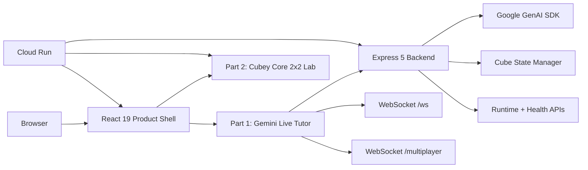

# AI Rubik's Tutor

AI Rubik's Tutor is a two-product Rubik's Cube repo built around one modern frontend system and one Cloud Run backend.

- Part 1: `Gemini Live Tutor` for realtime 3x3 coaching with voice, webcam vision, hints, move guidance, and multiplayer.
- Part 2: `Cubey Core 2x2 Lab` for deterministic cube logic, BFS/A*/IDA* solving, and exact playback on a shared 24-sticker state model.

## Two Products

| Part | Product | What it does | Main routes |
| --- | --- | --- | --- |
| 1 | Gemini Live Tutor | Realtime tutoring with Gemini, webcam frames, mic input, transcript memory, move hints, and multiplayer | `/`, `/part-1`, `/part-1/live`, `/part-1/multiplayer` |
| 2 | Cubey Core 2x2 Lab | Standalone 2x2 solver with one shared cube core, exact algorithms, manual controls, and solve playback | `/part-2`, `/legacy-2x2-solver/index.html` |

## Modern Stack

### Frontend

- React 19
- React Router 7
- Vite 7
- Tailwind CSS 4
- Framer Motion 12
- Three.js 0.183
- Zustand 5
- Vitest 4

### Backend

- Node.js 22+
- Express 5
- Google GenAI SDK `@google/genai`
- WebSocket transport with `ws`
- Zod 4 validation
- Helmet + compression + rate limiting

### Deployment

- Google Cloud Run for the full website and backend APIs
- Cloud Build for container build + rollout
- Artifact Registry + Secret Manager
- Docker multi-stage build with frontend assets bundled into the backend image

## What Changed In This Repo

- The repo is now framed around exactly two products instead of a main app plus an ambiguous legacy page.
- Part 1 and Part 2 use one shared visual language.
- Cloud Run is the primary deployment target instead of splitting frontend and backend hosting.
- The classic 2x2 lab keeps its exact solving behavior but now lives under the same product story.
- The submission evidence pack now lives in `submission/devpost-2026/` as documentation, not as a third project.

## Routes And Runtime Surface

### Product routes

- `/`
- `/part-1`
- `/part-1/live`
- `/part-1/multiplayer`
- `/part-2`
- `/legacy-2x2-solver/index.html`

### Backend routes

- `GET /health`
- `GET /api/health`
- `GET /api/runtime`
- `WS /ws`
- `WS /multiplayer`

## Architecture



## Repository Layout

```text
.
├── backend/                          # Express backend, Gemini integration, cube logic, WebSocket signaling
├── docs/                             # Product and feature notes
├── frontend/                         # React product shell plus Part 2 static app
│   ├── public/legacy-2x2-solver/     # Part 2 Cubey Core 2x2 lab
│   └── src/                          # Part 1 app shell, routed pages, shared UI
├── scripts/                          # Local start, cleanup, deploy, security helpers
├── submission/devpost-2026/          # Submission checklist, proof docs, description, architecture asset
├── terraform/                        # Cloud Run infrastructure inputs/outputs
├── cloudbuild.yaml                   # Cloud Build rollout
├── deploy.sh                         # Manual Cloud Run deploy helper
├── Dockerfile                        # Frontend + backend single-image build
├── SECURITY.md
└── README.md
```

## Quick Start

<details>
<summary>Install</summary>

```bash
npm ci --prefix backend
npm ci --prefix frontend
```

</details>

<details>
<summary>Environment</summary>

Start from:

```bash
cp .env.example .env
```

Minimum useful values:

```bash
PORT=8080
GEMINI_API_KEY=YOUR_GEMINI_API_KEY
GEMINI_LIVE_MODEL=gemini-live-2.5-flash-preview
GEMINI_FALLBACK_MODEL=gemini-2.5-flash
DEMO_MODE=false
VITE_BACKEND_ORIGIN=http://localhost:8080
```

Optional values:

```bash
CORS_ORIGIN=https://*.run.app,https://*.vercel.app,http://localhost:5173,http://127.0.0.1:5173
VITE_WS_URL=ws://localhost:8080/ws
VITE_SIGNALING_SERVER=ws://localhost:8080
VITE_ICE_SERVERS_JSON=[{"urls":"stun:stun.l.google.com:19302"}]
VITE_PUBLIC_BACKEND_ORIGIN=https://gemini-rubiks-tutor-vnc62azkwq-uc.a.run.app
ALLOW_INSECURE_CORS=false
ENABLE_FRONTEND_REDIRECT=false
```

`VITE_PUBLIC_BACKEND_ORIGIN` is useful when the frontend is hosted separately from the backend, for example a static Vercel deployment talking to Cloud Run.

</details>

<details>
<summary>Run Part 1</summary>

```bash
./scripts/start-gemini.sh
```

Open:

- `http://localhost:5173/`
- `http://localhost:5173/part-1/live`
- `http://localhost:5173/part-1/multiplayer`

</details>

<details>
<summary>Run Part 2</summary>

```bash
./scripts/start-core.sh
```

Open:

- `http://localhost:5173/part-2`

</details>

## Quality Checks

### Frontend

```bash
cd frontend
npm run lint
npm run test -- --run
npm run build
```

### Backend

```bash
cd backend
npm run lint
npm test
```

### Security gate

```bash
./scripts/security-check.sh --scope deploy
```

## Google Cloud Run Deployment

The repo is set up to ship the built frontend and backend as one Cloud Run service.

### Manual deploy

```bash
./deploy.sh YOUR_GCP_PROJECT_ID
```

What the deploy does:

- builds frontend assets
- builds a single Docker image
- pushes to Artifact Registry
- deploys Cloud Run
- wires `GEMINI_API_KEY` from Secret Manager
- keeps `ENABLE_FRONTEND_REDIRECT=false` so Cloud Run serves the site directly
- smoke-tests `/health`, `/api/runtime`, and the Part 2 entry page

### Cloud Build

`cloudbuild.yaml` mirrors the same rollout path for CI/CD.

## Submission Pack

The repo includes a clean Devpost-ready submission bundle:

- `submission/devpost-2026/README.md`
- `submission/devpost-2026/project-description.md`
- `submission/devpost-2026/requirements-crosscheck.md`
- `submission/devpost-2026/google-cloud-proof.md`
- `submission/devpost-2026/demo-video-script.md`
- `submission/devpost-2026/submission-checklist.md`
- `submission/devpost-2026/architecture-diagram.svg`

Optional packaging helper:

```bash
./scripts/package-devpost.sh
```

## Verified Public Cloud Links

Checked on March 7, 2026:

- Cloud Run app root: `https://gemini-rubiks-tutor-vnc62azkwq-uc.a.run.app/`
- Cloud Run health: `https://gemini-rubiks-tutor-vnc62azkwq-uc.a.run.app/health`
- Cloud Run runtime metadata: `https://gemini-rubiks-tutor-vnc62azkwq-uc.a.run.app/api/runtime`
- Cloud Run Part 2 route: `https://gemini-rubiks-tutor-vnc62azkwq-uc.a.run.app/part-2`
- Cloud Run Part 2 page: `https://gemini-rubiks-tutor-vnc62azkwq-uc.a.run.app/legacy-2x2-solver/index.html`

## Core Guardrails

- If you touch Part 2, keep `frontend/public/legacy-2x2-solver/cube-core.js` as the source of truth for 2x2 state and move logic.
- Keep visual alignment between Part 1 and Part 2 unless there is a deliberate reason to diverge.
- Preserve cube correctness before polishing visuals.

## Useful Files

- `frontend/src/App.jsx`
- `frontend/src/router.jsx`
- `frontend/public/legacy-2x2-solver/index.html`
- `frontend/public/legacy-2x2-solver/cube-core.js`
- `backend/src/server.js`
- `backend/src/runtimeInfo.js`
- `deploy.sh`
- `cloudbuild.yaml`
