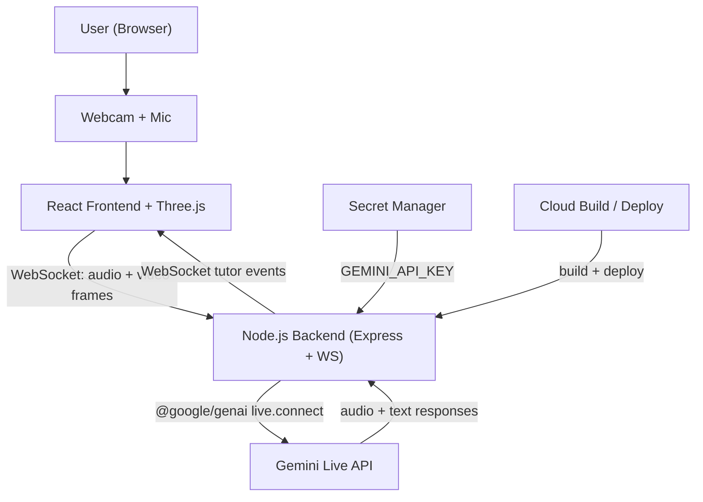

# Gemini Rubik's Tutor 🤖🧩

AI-powered Rubik's Cube tutoring with Google Gemini Live API - real-time voice + vision interaction.

<p align="center">
  <a href="https://gemini.google.com/">
    
  </a>
  <a href="https://react.dev/">
    
  </a>
  <a href="https://nodejs.org/">
    
  </a>
  <a href="https://cloud.google.com/run">
    
  </a>
</p>

- ✅ **Category:** Live Agents (Real-time Audio/Vision Interaction)
- ✅ **Technology:** Gemini Live API with `@google/genai` SDK
- ✅ **Cloud Platform:** Google Cloud Run (see [`terraform/`](terraform/) and [`cloudbuild.yaml`](cloudbuild.yaml))
- ✅ **Contest Deployment Profile:** `contest/.env.judges.example` + `contest/deploy-cloud-run.sh`

---

## 📦 Submission Assets

- Google Cloud IaC proof: [`terraform/main.tf`](terraform/main.tf), [`cloudbuild.yaml`](cloudbuild.yaml), [`deploy.sh`](deploy.sh)
- Contest profile: [`contest/.env.judges.example`](contest/.env.judges.example), [`contest/deploy-cloud-run.sh`](contest/deploy-cloud-run.sh)

---

## 🌟 Features

| Feature | Description |
|---------|-------------|
| **Live Multimodal** | Real-time audio + video streaming via Gemini Live API ("See, Hear, Speak") |
| **Auto Solve Agent** | Step-by-step 3D animated solving with real-time voice coaching |
| **Distinct Persona** | "Cubey": An encouraging, playful, and patient AI tutor |
| **Voice Interaction** | Natural conversation about cube solving (handles interruptions gracefully) |
| **3D Visualization** | Interactive Three.js Rubik's Cube synchronized with voice |
| **Grounding & State** | Uses Kociemba algorithms to verify cube state, strictly preventing hallucinations |
| **Challenge Mode** | Timed solve challenges with scoring and random scrambles |
| **Premium UI** | Frost glassmorphism design with Google-inspired typography |
| **Security Tested** | Validated against the Vibe Coding Security framework (`SECURITY.md`) |

---

## 🚀 Quick Start

### Prerequisites

- Node.js 20+
- npm or yarn
- Gemini API Key (optional for demo mode)

### Installation

```bash
# Backend
cd backend
npm install

# Frontend
cd frontend
npm install
```

### Running Locally

```bash
# Terminal 1 - Backend
cd backend
npm run dev

# Terminal 2 - Frontend
cd frontend
npm run dev
```

Open http://localhost:5173

### Real Gemini Mode vs Demo Mode

- `DEMO_MODE=false`: real Gemini Live Agent (voice + multimodal coaching).
- `DEMO_MODE=true`: local demo fallback (text guidance, no real Gemini voice stream).

If you see transcript text like `Demo mode enabled`, you are not using the real Gemini session.

### Demo Mode (No API Key)

```bash
# Set demo mode
export DEMO_MODE=true

# Or use contest profile
cp contest/.env.judges.example .env
```

---

## Troubleshooting

### "Connection lost... ws://localhost:5173/ws"

Your backend is not reachable from frontend. Make sure backend is running on `:8080`:

```bash
curl http://localhost:8080/health
```

If this fails, restart backend and frontend.

### No Gemini voice/audio

1. Set `DEMO_MODE=false` in `.env`.
2. Set a valid `GEMINI_API_KEY`.
3. Restart backend and frontend after env changes.
4. In browser, click `Start Session` and allow microphone/camera.

---

## 📁 Project Structure

```
Gemini-Rubiks-Tutor/
├── backend/                  # Express + WebSocket server
│   ├── src/
│   │   ├── server.js         # Main server
│   │   ├── geminiLiveClient.js
│   │   ├── cubeStateManager.js
│   │   └── tutorPrompt.js
│   └── package.json
├── frontend/                  # React + Vite app
│   ├── src/
│   │   ├── App.jsx
│   │   ├── components/
│   │   │   ├── LiveSession.jsx
│   │   │   ├── CubeViewer.jsx
│   │   │   └── StatusBar.jsx
│   │   └── main.jsx
│   └── package.json
├── contest/                   # Contest profile
│   ├── .env.judges.example
│   └── deploy-cloud-run.sh
├── terraform/                 # Infrastructure
│   ├── main.tf
│   ├── variables.tf
│   └── outputs.tf
├── cloudbuild.yaml           # CI/CD
├── deploy.sh                # Deployment script
└── Dockerfile               # Container image
```

---

## 🔧 Environment Variables

| Variable | Description | Required |
|----------|-------------|----------|
| `PORT` | Server port (default: 8080) | No |
| `GEMINI_API_KEY` | Google Gemini API key | Yes* |
| `DEMO_MODE` | Enable demo mode (default: false) | No |

*Required unless `DEMO_MODE=true`

---

## 🔐 Security Gate

- Security checklist: [`SECURITY.md`](SECURITY.md)
- Agent guardrail: [`AGENTS.md`](AGENTS.md)
- Automated gate script: `./scripts/security-check.sh`
- Security memory log: `.runtime/security-memory.log`

Enable commit/push hooks once per clone:

```bash
./scripts/install-git-hooks.sh
```

Manual checks:

```bash
./scripts/security-check.sh --scope prompt --context "short summary of current request"
./scripts/security-check.sh --scope commit
./scripts/security-check.sh --scope push
./scripts/security-check.sh --scope deploy
```

---

## ☁️ Cloud Deployment

### Google Cloud Run

```bash
# Using deploy script
./deploy.sh YOUR_GCP_PROJECT_ID

# Manual
gcloud builds submit --config cloudbuild.yaml
gcloud run deploy gemini-rubiks-tutor \
  --image gcr.io/$PROJECT_ID/gemini-rubiks-tutor \
  --platform managed \
  --region us-central1 \
  --allow-unauthenticated
```

### Terraform

```bash
cd terraform
terraform init
terraform plan
terraform apply
```

---

## 🎯 Contest Requirements & Judging Criteria Coverage

### Innovation & Multimodal User Experience (40%)
- ✅ **Breaking the Text Box Paradigm:** Moves completely beyond text by allowing users to physically hold a puzzle and talk hands-free.
- ✅ **See, Hear, and Speak:** Employs the webcam (`image/jpeg` sampling), microphone, and speakers for a fully continuous multimodal loop.
- ✅ **Distinct Persona:** Programmed with "Cubey," a patient, encouraging tutor character that makes learning fun.
- ✅ **Interruption Handling:** Native Live API barge-in capabilities allow the user to interrupt the solver naturally if they make a mistake.

### Technical Implementation & Agent Architecture (30%)
- ✅ **Google Cloud & SDKs:** Built natively with `@google/genai` SDK and fully hosted on Google Cloud Run.
- ✅ **Grounding & Avoiding Hallucinations:** The physical cube state is verified continuously against a deterministic mathematical algorithm (Kociemba). Gemini coaches *based on this structured state*, entirely eliminating AI movement hallucinations.

### Bonus Points Completed
- ✅ **Automated Cloud Infrastructure:** Fully orchestrated IaC provided in `terraform/`, paired with `cloudbuild.yaml` and `deploy.sh`.
- ✅ **Content Publication:** A project walkthrough blog is prepared to meet the social media publication criteria (Remember to publish with `#GeminiLiveAgentChallenge`).

---

## 🏗️ Architecture Diagram



---

## 📋 Submission Checklist (Code Repo)

- ✅ Public repo includes full spin-up steps.
- ✅ Gemini model usage shown in code: [`backend/src/geminiLiveClient.js`](backend/src/geminiLiveClient.js).
- ✅ Google Cloud usage shown in code: [`terraform/main.tf`](terraform/main.tf), [`cloudbuild.yaml`](cloudbuild.yaml), [`deploy.sh`](deploy.sh).
- ✅ Architecture diagram included in this README.
- ✅ Health endpoint and runtime checks available (`GET /health`, WebSocket `/ws`).

---

## 🔬 Technical Deep Dive

### Audio Processing

- WebRTC audio capture from browser
- PCM16LE raw audio encoding
- Streaming via Gemini Live API
- Voice Activity Detection (VAD)

### Video Processing

- Canvas frame capture at ~4fps with motion-based frame skipping
- JPEG compression for efficiency
- Multimodal content delivery to Gemini

### Cube State

- Kociemba algorithm for solution verification
- CFOP method tutoring (Cross → F2L → OLL → PLL)
- Real-time 3D rendering with Three.js

---

## 🙏 Acknowledgments

- [Google Gemini](https://gemini.google.com/) for Live API
- [Three.js](https://threejs.org/) for 3D rendering
- [Kociemba](https://github.com/hkociemba/RubiksCube-TwophaseSolver) for cube solving
