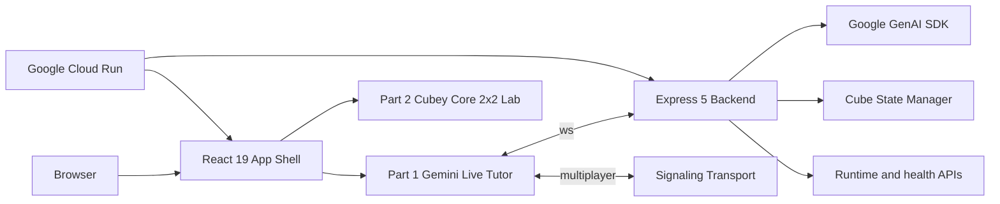

# AI Rubik's Tutor

<p align="center">
  
</p>

<p align="center">
  <strong>A two-project Rubik's Cube monorepo built around Gemini Live, React 19, and Google Cloud Run.</strong>
</p>

AI Rubik's Tutor is one repository with two distinct products:

- **Part 1: Gemini Live Tutor**
  A realtime 3x3 coaching workspace that uses voice, webcam frames, live tutor responses, hints, challenge mode, and multiplayer signaling.
- **Part 2: Cubey Core 2x2 Lab**
  A deterministic 2x2 solver/lab with shared cube-state logic, manual controls, and exact BFS, A*, and IDA* playback.

## Repository Overview

| Area | What it contains |
| --- | --- |
| `frontend/` | React app shell, routed product UI, shared components, hooks, state, and the public Part 2 static app |
| `backend/` | Express backend, Gemini integration, runtime APIs, cube-state logic, and websocket handling |
| `scripts/` | Local developer entry scripts for Part 1 and Part 2 |
| `.github/workflows/` | CI pipeline for lint, tests, and frontend build |
| `Dockerfile` | Single-image build that serves the frontend from the backend container |
| `cloudbuild.yaml` | Cloud Build pipeline for Google Cloud Run deployment |
| `deploy.sh` | Manual Cloud Run deployment helper |

## The Two Projects

### Part 1: Gemini Live Tutor

Purpose:
- coach a 3x3 solve in realtime
- keep the interaction multimodal instead of text-only
- combine camera input, microphone input, tutor guidance, move visualization, and session memory in one workspace

Primary routes:
- `/`
- `/part-1`
- `/part-1/live`
- `/part-1/multiplayer`

Main implementation areas:
- [frontend/src/App.jsx](frontend/src/App.jsx)
- [frontend/src/components/LiveSession.jsx](frontend/src/components/LiveSession.jsx)
- [frontend/src/components/TutorOverlay.jsx](frontend/src/components/TutorOverlay.jsx)
- [frontend/src/hooks/useMultiplayer.js](frontend/src/hooks/useMultiplayer.js)
- [backend/src/server.js](backend/src/server.js)
- [backend/src/geminiLiveClient.js](backend/src/geminiLiveClient.js)

Core capabilities:
- Gemini Live audio session handling
- webcam frame capture and tutor grounding
- interruptible tutor playback
- hint requests and auto-solve flow
- challenge mode and move coaching
- WebRTC multiplayer signaling
- runtime metadata via `/api/runtime`

### Part 2: Cubey Core 2x2 Lab

Purpose:
- expose the deterministic cube core separately from the live tutor
- provide an exact, inspectable 2x2 solving experience
- keep manual controls, algorithm comparison, and playback available without the live stack

Primary routes:
- `/part-2`
- `/legacy-2x2-solver/index.html`

Main implementation areas:
- [frontend/public/legacy-2x2-solver/index.html](frontend/public/legacy-2x2-solver/index.html)
- [frontend/public/legacy-2x2-solver/app.js](frontend/public/legacy-2x2-solver/app.js)
- [frontend/public/legacy-2x2-solver/cube-core.js](frontend/public/legacy-2x2-solver/cube-core.js)
- [frontend/public/legacy-2x2-solver/solver.js](frontend/public/legacy-2x2-solver/solver.js)
- [frontend/public/legacy-2x2-solver/a-star-solver.js](frontend/public/legacy-2x2-solver/a-star-solver.js)
- [frontend/public/legacy-2x2-solver/cube-engine.js](frontend/public/legacy-2x2-solver/cube-engine.js)

Core capabilities:
- shared 24-sticker cube model
- manual move controls
- scramble/reset flow
- BFS, A*, and IDA* solving
- exact solution playback
- theme-aware UI aligned with the main frontend

## Current Stack

### Frontend

- React 19
- React Router 7
- Vite 7
- Tailwind CSS 4
- Framer Motion 12
- Three.js 0.183
- Zustand 5
- Vitest 4

Frontend package source:
- [frontend/package.json](frontend/package.json)

### Backend

- Node.js 22
- Express 5
- Google GenAI SDK via `@google/genai`
- `ws` for websocket transport
- Zod 4 for message validation
- Helmet, compression, and express-rate-limit

Backend package source:
- [backend/package.json](backend/package.json)

## Runtime Surface

The backend advertises the current runtime surface in [backend/src/runtimeInfo.js](backend/src/runtimeInfo.js).

HTTP routes:
- `GET /health`
- `GET /api/health`
- `GET /api/runtime`

WebSocket paths:
- `WS /ws`
- `WS /multiplayer`

App routes:
- `/`
- `/part-1`
- `/part-1/live`
- `/part-1/multiplayer`
- `/live` -> redirect
- `/labs/multiplayer` -> redirect
- `/part-2` -> redirect to the static 2x2 app
- `/classic` -> redirect

Frontend routing source:
- [frontend/src/router.jsx](frontend/src/router.jsx)

## Architecture



## Root Structure

```text
.
├── backend/
│   ├── src/
│   ├── package.json
│   └── eslint.config.js
├── frontend/
│   ├── public/
│   │   └── legacy-2x2-solver/
│   ├── src/
│   ├── package.json
│   ├── vite.config.js
│   └── vitest.config.js
├── scripts/
│   ├── start-core.sh
│   └── start-gemini.sh
├── .github/workflows/
│   └── ci.yml
├── .env.example
├── Dockerfile
├── cloudbuild.yaml
├── deploy.sh
└── README.md
```

Notes:
- generated directories like `frontend/dist`, `frontend/dev-dist`, `backend/cache`, and `node_modules/` are local artifacts, not source
- Part 2 intentionally remains under `frontend/public/legacy-2x2-solver/` because it is shipped as a static entry alongside the main routed app

## Local Development

### Install dependencies

```bash
npm ci --prefix backend
npm ci --prefix frontend
```

### Create `.env`

```bash
cp .env.example .env
```

Minimum useful values:

```bash
PORT=8080
GEMINI_API_KEY=YOUR_GEMINI_API_KEY
GEMINI_LIVE_MODEL=gemini-live-2.5-flash-preview
GEMINI_FALLBACK_MODEL=gemini-2.5-flash
DEMO_MODE=false
VITE_BACKEND_ORIGIN=http://localhost:8080
```

Optional values:

```bash
CORS_ORIGIN=https://*.run.app,https://*.vercel.app,http://localhost:5173,http://127.0.0.1:5173
VITE_WS_URL=ws://localhost:8080/ws
VITE_SIGNALING_SERVER=ws://localhost:8080
VITE_ICE_SERVERS_JSON=[{"urls":"stun:stun.l.google.com:19302"}]
VITE_PUBLIC_BACKEND_ORIGIN=https://gemini-rubiks-tutor-vnc62azkwq-uc.a.run.app
ALLOW_INSECURE_CORS=false
ENABLE_FRONTEND_REDIRECT=false
```

Environment template:
- [.env.example](.env.example)

### Run Part 1

```bash
./scripts/start-gemini.sh
```

This starts:
- backend on `http://localhost:8080`
- frontend on `http://localhost:5173`

Useful URLs:
- `http://localhost:5173/`
- `http://localhost:5173/part-1/live`
- `http://localhost:5173/part-1/multiplayer`

### Run Part 2

```bash
./scripts/start-core.sh
```

Useful URL:
- `http://localhost:5173/part-2`

## Validation

### Frontend

```bash
cd frontend
npm run lint
npm run test -- --run
npm run build
```

### Backend

```bash
cd backend
npm run lint
npm run test -- --run
```

### CI

GitHub Actions runs:
- backend lint
- backend tests
- frontend lint
- frontend tests
- frontend build

Workflow:
- [.github/workflows/ci.yml](.github/workflows/ci.yml)

## Deployment

The repository is designed for a single Google Cloud Run deployment where the backend serves the built frontend.

### Manual deployment

```bash
./deploy.sh YOUR_GCP_PROJECT_ID
```

What `deploy.sh` does:
1. validates the target project and required GCP APIs
2. ensures Artifact Registry and Secret Manager are ready
3. builds the container image
4. deploys to Cloud Run
5. smoke-tests health, runtime, and Part 2 entry routes

Deployment script:
- [deploy.sh](deploy.sh)

### Cloud Build deployment

```bash
gcloud builds submit --config cloudbuild.yaml .
```

Pipeline source:
- [cloudbuild.yaml](cloudbuild.yaml)

### Container build

The production image is a multi-stage build:
- stage 1 builds the frontend
- stage 2 installs backend production dependencies
- the backend serves the built frontend assets

Container source:
- [Dockerfile](Dockerfile)

## Public Deployment

Current Cloud Run service:
- `https://gemini-rubiks-tutor-vnc62azkwq-uc.a.run.app/`

Useful public URLs:
- app root: `https://gemini-rubiks-tutor-vnc62azkwq-uc.a.run.app/`
- runtime: `https://gemini-rubiks-tutor-vnc62azkwq-uc.a.run.app/api/runtime`
- health: `https://gemini-rubiks-tutor-vnc62azkwq-uc.a.run.app/health`
- Part 1 live: `https://gemini-rubiks-tutor-vnc62azkwq-uc.a.run.app/part-1/live`
- Part 2: `https://gemini-rubiks-tutor-vnc62azkwq-uc.a.run.app/part-2`

Latest verified ready revision:
- `gemini-rubiks-tutor-00011-mn2`

## Repository Notes

- Part 1 and Part 2 intentionally live together because the tutor product and the cube logic product share state models, visual language, and deployment infrastructure.
- Part 1 is the multimodal agent surface.
- Part 2 is the deterministic algorithm surface.
- The README is meant to describe the repository as a GitHub project first, not just as a hackathon artifact.
