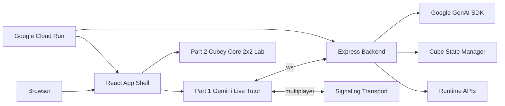

# AI Rubik's Tutor

<p align="center">
  
</p>

<p align="center">
  <strong>Two Rubik's Cube products in one monorepo: a realtime Gemini tutor and a deterministic 2x2 solver lab.</strong>
</p>

<p align="center">
  <a href="https://react.dev">React 19</a>
  ·
  <a href="https://vite.dev">Vite 7</a>
  ·
  <a href="https://tailwindcss.com">Tailwind CSS 4</a>
  ·
  <a href="https://cloud.google.com/run">Google Cloud Run</a>
  ·
  <a href="https://ai.google.dev">Google GenAI SDK</a>
</p>

<p align="center">
  <a href="#products">Products</a>
  ·
  <a href="#stack">Stack</a>
  ·
  <a href="#architecture">Architecture</a>
  ·
  <a href="#repository-layout">Repository Layout</a>
  ·
  <a href="#local-development">Local Development</a>
  ·
  <a href="#deployment">Deployment</a>
</p>

## Overview

AI Rubik's Tutor is a GitHub-first monorepo with two related applications:

- **Part 1: Gemini Live Tutor**
  A realtime 3x3 coaching interface built around webcam frames, microphone streaming, live tutor responses, move guidance, challenge mode, and multiplayer signaling.
- **Part 2: Cubey Core 2x2 Lab**
  A deterministic 2x2 cube lab built around shared cube-state logic, manual controls, and exact BFS, A*, and IDA* playback.

The repo is organized so both products share one deployment model, one visual language, and one codebase story, while still being easy to work on separately.

## Products

| Part | Product | Purpose | Main routes | Primary code |
| --- | --- | --- | --- | --- |
| 1 | Gemini Live Tutor | Realtime AI tutoring for a physical or virtual 3x3 cube using voice and vision | `/`, `/part-1`, `/part-1/live`, `/part-1/multiplayer` | `frontend/src/`, `backend/src/` |
| 2 | Cubey Core 2x2 Lab | Deterministic 2x2 solving, playback, and algorithm inspection | `/part-2`, `/legacy-2x2-solver/index.html` | `frontend/public/legacy-2x2-solver/` |

### Part 1: Gemini Live Tutor

What it does:
- streams webcam frames and mic input to the live tutoring session
- keeps tutor responses on the same stage as the cube
- supports hints, auto-solve, challenge mode, and multiplayer
- exposes runtime health and connection metadata to the frontend

Main files:
- [frontend/src/App.jsx](frontend/src/App.jsx)
- [frontend/src/components/LiveSession.jsx](frontend/src/components/LiveSession.jsx)
- [frontend/src/components/TutorOverlay.jsx](frontend/src/components/TutorOverlay.jsx)
- [frontend/src/hooks/useMultiplayer.js](frontend/src/hooks/useMultiplayer.js)
- [backend/src/server.js](backend/src/server.js)
- [backend/src/geminiLiveClient.js](backend/src/geminiLiveClient.js)

### Part 2: Cubey Core 2x2 Lab

What it does:
- exposes the 2x2 cube engine directly
- allows manual moves, scramble/reset, and exact solution playback
- keeps the solving logic inspectable outside the live tutor
- ships as a static entry under the same frontend/public surface

Main files:
- [frontend/public/legacy-2x2-solver/index.html](frontend/public/legacy-2x2-solver/index.html)
- [frontend/public/legacy-2x2-solver/app.js](frontend/public/legacy-2x2-solver/app.js)
- [frontend/public/legacy-2x2-solver/cube-core.js](frontend/public/legacy-2x2-solver/cube-core.js)
- [frontend/public/legacy-2x2-solver/solver.js](frontend/public/legacy-2x2-solver/solver.js)
- [frontend/public/legacy-2x2-solver/a-star-solver.js](frontend/public/legacy-2x2-solver/a-star-solver.js)
- [frontend/public/legacy-2x2-solver/cube-engine.js](frontend/public/legacy-2x2-solver/cube-engine.js)

## Stack

| Layer | Current stack |
| --- | --- |
| Frontend app shell | React 19, React Router 7, Vite 7 |
| Styling and motion | Tailwind CSS 4, Framer Motion 12 |
| 3D rendering | Three.js 0.183 |
| State | Zustand 5 with persisted UI/session state |
| Frontend tests | Vitest 4 |
| Backend runtime | Node.js 22, Express 5 |
| Realtime transport | `ws` websockets, WebRTC signaling |
| Validation and hardening | Zod 4, Helmet, compression, express-rate-limit |
| Gemini integration | `@google/genai` |
| Hosting | Google Cloud Run, Cloud Build, Artifact Registry, Secret Manager |

Source of truth:
- [frontend/package.json](frontend/package.json)
- [backend/package.json](backend/package.json)

## Runtime Surface

The backend publishes its runtime contract from [backend/src/runtimeInfo.js](backend/src/runtimeInfo.js).

### HTTP

| Method | Path | Purpose |
| --- | --- | --- |
| `GET` | `/health` | basic service health |
| `GET` | `/api/health` | structured health payload |
| `GET` | `/api/runtime` | runtime metadata for frontend discovery |

### WebSocket

| Path | Purpose |
| --- | --- |
| `/ws` | Part 1 live tutor session transport |
| `/multiplayer` | multiplayer signaling transport |

### App Routing

Frontend routing is defined in [frontend/src/router.jsx](frontend/src/router.jsx).

| Route | Behavior |
| --- | --- |
| `/` | overview / landing workspace |
| `/part-1` | Part 1 entry |
| `/part-1/live` | live tutor workspace |
| `/part-1/multiplayer` | multiplayer workspace |
| `/live` | redirect to `/part-1/live` |
| `/labs/multiplayer` | redirect to `/part-1/multiplayer` |
| `/part-2` | redirect to the static 2x2 app |
| `/classic` | redirect shortcut |

## Architecture



## Repository Layout

```text
.
├── backend/
│   ├── src/
│   ├── package.json
│   └── eslint.config.js
├── frontend/
│   ├── public/
│   │   └── legacy-2x2-solver/
│   ├── src/
│   ├── package.json
│   ├── vite.config.js
│   └── vitest.config.js
├── scripts/
│   ├── start-core.sh
│   └── start-gemini.sh
├── .github/workflows/
│   └── ci.yml
├── .env.example
├── Dockerfile
├── cloudbuild.yaml
├── deploy.sh
└── README.md
```

Key notes:
- `frontend/public/legacy-2x2-solver/` is intentionally kept as a static app because Part 2 is shipped alongside the routed React shell
- generated directories like `frontend/dist`, `frontend/dev-dist`, `backend/cache`, and `node_modules/` are local build artifacts, not source

## Local Development

### Install dependencies

```bash
npm ci --prefix backend
npm ci --prefix frontend
```

### Create local environment

```bash
cp .env.example .env
```

Minimum useful values:

```bash
PORT=8080
GEMINI_API_KEY=YOUR_GEMINI_API_KEY
GEMINI_LIVE_MODEL=gemini-live-2.5-flash-preview
GEMINI_FALLBACK_MODEL=gemini-2.5-flash
DEMO_MODE=false
VITE_BACKEND_ORIGIN=http://localhost:8080
```

Optional values:

```bash
CORS_ORIGIN=https://*.run.app,https://*.vercel.app,http://localhost:5173,http://127.0.0.1:5173
VITE_WS_URL=ws://localhost:8080/ws
VITE_SIGNALING_SERVER=ws://localhost:8080
VITE_ICE_SERVERS_JSON=[{"urls":"stun:stun.l.google.com:19302"}]
VITE_PUBLIC_BACKEND_ORIGIN=https://gemini-rubiks-tutor-vnc62azkwq-uc.a.run.app
ALLOW_INSECURE_CORS=false
ENABLE_FRONTEND_REDIRECT=false
```

Environment template:
- [.env.example](.env.example)

### Run Part 1

```bash
./scripts/start-gemini.sh
```

This starts:
- backend on `http://localhost:8080`
- frontend on `http://localhost:5173`

Useful URLs:
- `http://localhost:5173/`
- `http://localhost:5173/part-1/live`
- `http://localhost:5173/part-1/multiplayer`

### Run Part 2

```bash
./scripts/start-core.sh
```

Useful URL:
- `http://localhost:5173/part-2`

## Validation

### Frontend

```bash
cd frontend
npm run lint
npm run test -- --run
npm run build
```

### Backend

```bash
cd backend
npm run lint
npm run test -- --run
```

### CI

GitHub Actions runs:
- backend lint
- backend tests
- frontend lint
- frontend tests
- frontend build

Workflow:
- [.github/workflows/ci.yml](.github/workflows/ci.yml)

## Deployment

This repo is designed for a single Google Cloud Run deployment where the backend serves the built frontend.

### Manual deploy

```bash
./deploy.sh YOUR_GCP_PROJECT_ID
```

What `deploy.sh` does:
1. configures the target GCP project
2. enables required Google Cloud APIs
3. ensures Artifact Registry and Secret Manager are ready
4. builds the container image
5. deploys the service to Cloud Run
6. smoke-tests health, runtime, and the Part 2 entry page

Deployment sources:
- [deploy.sh](deploy.sh)
- [cloudbuild.yaml](cloudbuild.yaml)
- [Dockerfile](Dockerfile)

### Cloud Build

```bash
gcloud builds submit --config cloudbuild.yaml .
```

## Public Deployment

Current public service:
- `https://gemini-rubiks-tutor-vnc62azkwq-uc.a.run.app/`

Useful URLs:
- app root: `https://gemini-rubiks-tutor-vnc62azkwq-uc.a.run.app/`
- health: `https://gemini-rubiks-tutor-vnc62azkwq-uc.a.run.app/health`
- runtime: `https://gemini-rubiks-tutor-vnc62azkwq-uc.a.run.app/api/runtime`
- Part 1 live: `https://gemini-rubiks-tutor-vnc62azkwq-uc.a.run.app/part-1/live`
- Part 2: `https://gemini-rubiks-tutor-vnc62azkwq-uc.a.run.app/part-2`

Latest verified ready revision:
- `gemini-rubiks-tutor-00011-mn2`

## Notes

- Part 1 is the multimodal agent product.
- Part 2 is the deterministic cube-core product.
- They live together because they share product language, deployment infrastructure, and problem space, even though their interaction models are different.
- This README is written to explain the repository accurately as a GitHub project, not as a one-off demo page.
