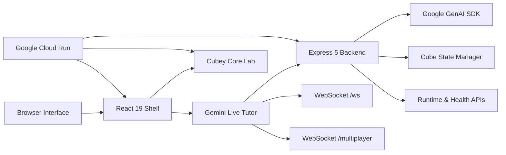

# AI Rubik's Tutor 2026

<div align="center">
  
  <h3>The future of 3D cognitive training, powered by Gemini Live.</h3>
  
  [](https://vitejs.dev)
  [](https://react.dev)
  [](https://tailwindcss.com)
  [](https://cloud.google.com/run)
  [](https://deepmind.google/technologies/gemini/)
</div>

---

## 🚀 One Repo. Two Intelligent Worlds.

AI Rubik's Tutor is a unified 2026 workspace that bridges high-level AI coaching with low-level deterministic logic. It's built around **one modern frontend system** and **one Cloud Run backend**.

### 🎙️ Part 1: Gemini Live Tutor
> **Realtime 3x3 coaching with voice, vision, and memory.**
> A realtime 3x3 coaching engine. It sees your physical cube via webcam, listens to your questions, and guides you to victory with voice, move-specific hints, and a shared 3D stage.
- **Routes:** `/`, `/part-1`, `/part-1/live`, `/part-1/multiplayer`.

### 🧪 Part 2: Cubey Core 2x2 Lab
> **Deterministic cube logic and exact solving search.**
> A standalone 2x2 solver with one shared cube core, manual controls, and exact BFS, A*, and IDA* playback on a shared 24-sticker state model.
- **Routes:** `/part-2`, `/legacy-2x2-solver/index.html`.

---

## ✨ Two Products

| Part | Product | What it does | Main Routes |
| :--- | :--- | :--- | :--- |
| **1** | **Gemini Live Tutor** | Realtime tutoring with Gemini, webcam frames, mic input, transcript memory, move hints, and multiplayer | `/`, `/part-1`, `/part-1/live`, `/part-1/multiplayer` |
| **2** | **Cubey Core 2x2 Lab** | Standalone 2x2 solver with shared cube core, exact algorithms, manual controls, and solve playback | `/part-2`, `/legacy-2x2-solver/index.html` |

---

## 🛠️ Modern Tech Stack (2026 Edition)

### 🎨 Frontend Performance
- **Framework:** React 19
- **Routing:** React Router 7
- **Build Tooling:** Vite 7
- **Styling:** Tailwind CSS 4
- **Animations:** Framer Motion 12
- **3D Workspace:** Three.js 0.183
- **State Engine:** Zustand 5
- **Testing:** Vitest 4

### 🧠 Backend Intelligence
- **Runtime:** Node.js 22+
- **Framework:** Express 5
- **AI SDK:** Google GenAI SDK (`@google/genai`)
- **Realtime:** WebSocket transport with `ws`
- **Integrity:** Zod 4 validation
- **Middleware:** Helmet + compression + rate limiting

---

## 📦 Deployment & Cloud Strategy

- **Google Cloud Run**: The primary target for the unified website and backend APIs.
- **Cloud Build**: Automated container builds and production rollout.
- **Artifact Registry**: Private storage for the single-container project.
- **Secret Manager**: Secure provisioning of the `GEMINI_API_KEY`.
- **Docker Architecture**: Multi-stage builds that bundle the React 19 frontend into the Node.js production container.

---

## 🏗️ Technical Architecture



---

## 📁 Repository Layout

```text
.
├── backend/                          # Express backend, Gemini integration, cube logic, WebSocket signaling
├── docs/                             # Project assets, logos, and feature catalogs
├── frontend/                         # React product shell plus Part 2 static app
│   ├── public/legacy-2x2-solver/     # Part 2 Cubey Core 2x2 lab
│   └── src/                          # Part 1 app shell, routed pages, shared UI primitives
├── scripts/                          # Local start, cleanup, deploy, and security helpers
├── terraform/                        # Cloud Run infrastructure definitions
├── cloudbuild.yaml                   # Cloud Build rollout pipeline
├── deploy.sh                         # High-level Cloud Run deploy entrypoint
├── Dockerfile                        # Integrated Frontend + Backend single-image build
├── SECURITY.md                       # Security policies
└── README.md                         # Product landing page and guide
```

---

## 🚦 Quick Start Guide

### 1. Installation
```bash
npm ci --prefix backend
npm ci --prefix frontend
```

### 2. Environment Setup
Clone the example file:
```bash
cp .env.example .env
```

**Minimum Required Settings:**
```bash
PORT=8080
GEMINI_API_KEY=YOUR_GEMINI_API_KEY
GEMINI_LIVE_MODEL=gemini-live-2.5-flash-preview
GEMINI_FALLBACK_MODEL=gemini-2.5-flash
DEMO_MODE=false
VITE_BACKEND_ORIGIN=http://localhost:8080
```

**Advanced Controls:**
```bash
CORS_ORIGIN=https://*.run.app,https://*.vercel.app,http://localhost:5173,http://127.0.0.1:5173
VITE_WS_URL=ws://localhost:8080/ws
VITE_SIGNALING_SERVER=ws://localhost:8080
VITE_ICE_SERVERS_JSON=[{"urls":"stun:stun.l.google.com:19302"}]
VITE_PUBLIC_BACKEND_ORIGIN=https://gemini-rubiks-tutor-vnc62azkwq-uc.a.run.app
ALLOW_INSECURE_CORS=false
ENABLE_FRONTEND_REDIRECT=false
```

---

### 🎙️ Running Part 1 (Tutor)
```bash
./scripts/start-gemini.sh
```
Explore: `http://localhost:5173/` • `/part-1/live` • `/part-1/multiplayer`.

---

### 🧪 Running Part 2 (Lab)
```bash
./scripts/start-core.sh
```
Explore: `http://localhost:5173/part-2`.

---

## 🧪 Quality & Verification

### Suite Checks
| Target | Commands |
| :--- | :--- |
| **Frontend** | `cd frontend && npm run lint && npm run test -- --run && npm run build` |
| **Backend** | `cd backend && npm run lint && npm test` |
| **Security** | `./scripts/security-check.sh --scope deploy` |

---

## 🚀 Google Cloud Run Rollout

The repository is built for **Cloud Run**, shipping the built frontend and backend as a single atomic service.

### Single-Command Deploy:
```bash
./deploy.sh <YOUR_GCP_PROJECT_ID>
```

**What the deploy handles automatically:**
1.  Compiles the **React 19** frontend.
2.  Bridges assets into the **Express 5** image.
3.  Uploads to **Artifact Registry**.
4.  Wires secrets (GEMINI_API_KEY) and deploys to **Cloud Run**.
5.  Executes real-world **Smoke Tests** on health and routing endpoints.

---

## 🏛️ Project Governance & Guardrails

- **Shared State:** Part 2 `cube-core.js` is the single source of truth for 2x2 state logic.
- **Visual Integrity:** Maintain alignment between Part 1 and Part 2 design primitives.
---

<p align="center">
  <b>Built with Gemini 2.x & React 19</b>
  <br/>
  Designed by Mangesh Raut
</p>
