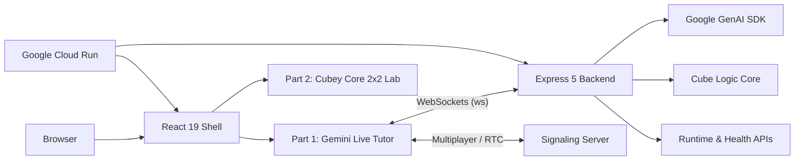

# AI Rubik's Tutor 2026

<div align="center">
  
  <h3>Real-time 3D Cognitive Training powered by Gemini 2.x Live</h3>

  [](https://vitejs.dev)
  [](https://react.dev)
  [](https://tailwindcss.com)
  [](https://cloud.google.com/run)
  [](https://deepmind.google/technologies/gemini/)
</div>

---

<p align="center">
  <strong>One repository. Two Rubik's Cube products. One Google Cloud deployment path.</strong>
</p>

AI Rubik's Tutor is a unified 2026 workspace:

- **Part 1: Gemini Live Tutor**
  A realtime 3x3 coaching workspace with webcam input, microphone streaming, tutor responses, live move guidance, challenge mode, and multiplayer signaling.
- **Part 2: Cubey Core 2x2 Lab**
  A deterministic 2x2 solver/lab with shared cube-state logic, manual move controls, and exact BFS, A*, and IDA* playback.

## At A Glance

| Area | 2026 High-Performance Stack |
| --- | --- |
| **Frontend** | React 19, React Router 7, Vite 7, Tailwind 4, Framer Motion 12, Three.js 0.183, Zustand 5 |
| **Backend** | Node.js 22 LTS, Express 5, `ws` (High-perf WebSockets), Zod 4, Helmet security |
| **Gemini Integration** | Google GenAI SDK (`@google/genai`) |
| **Intelligence** | `gemini-live-2.5-flash-preview` (Live) + `gemini-2.5-flash` (Fallback) |
| **Infra** | Google Cloud Run, Cloud Build, Artifact Registry, Secret Manager |
| **Deployment** | [Production URL](https://gemini-rubiks-tutor-vnc62azkwq-uc.a.run.app/) |

## Architecture



## Root Structure

The root of the repository is intentionally small:

```text
.
├── backend/            # Express backend, Gemini integration, runtime APIs, WebSocket handling
├── frontend/           # React shell plus public Part 2 lab assets
├── scripts/            # Local start scripts
├── .github/workflows/  # CI
├── Dockerfile          # Single-image frontend + backend build
├── cloudbuild.yaml     # Cloud Build deploy pipeline
├── deploy.sh           # Manual Cloud Run deploy helper
└── .env.example        # Local configuration template
```

## Folder Notes

### `backend/`

- `src/server.js`
  Main HTTP + websocket entrypoint.
- `src/geminiLiveClient.js`
  Gemini Live session handling.
- `src/cubeStateManager.js`
  3x3 cube state, scrambles, and solve-path utilities.
- `src/routes/systemRoutes.js`
  Health/runtime endpoints for ops and frontend discovery.

### `frontend/`

- `src/`
  The routed React app shell, Part 1 surfaces, shared UI primitives, state, hooks, and tests.
- `public/legacy-2x2-solver/`
  The Part 2 standalone lab and its 2x2 solving engine.
- `src/utils/` and `src/hooks/`
  Shared app logic with colocated tests.

### `scripts/`

- [start-gemini.sh](scripts/start-gemini.sh)
  Starts backend + frontend together for Part 1 development.
- [start-core.sh](scripts/start-core.sh)
  Starts the frontend for Part 2-focused work.

## Local Development

### 1. Install dependencies

```bash
npm ci --prefix backend
npm ci --prefix frontend
```

### 2. Create local env

```bash
cp .env.example .env
```

Minimum useful values:

```bash
PORT=8080
GEMINI_API_KEY=YOUR_GEMINI_API_KEY
GEMINI_LIVE_MODEL=gemini-live-2.5-flash-preview
GEMINI_FALLBACK_MODEL=gemini-2.5-flash
DEMO_MODE=false
VITE_BACKEND_ORIGIN=http://localhost:8080
```

Optional hosted-frontend values:

```bash
CORS_ORIGIN=https://*.run.app,https://*.vercel.app,http://localhost:5173,http://127.0.0.1:5173
VITE_WS_URL=ws://localhost:8080/ws
VITE_SIGNALING_SERVER=ws://localhost:8080
VITE_ICE_SERVERS_JSON=[{"urls":"stun:stun.l.google.com:19302"}]
VITE_PUBLIC_BACKEND_ORIGIN=https://gemini-rubiks-tutor-vnc62azkwq-uc.a.run.app
ALLOW_INSECURE_CORS=false
ENABLE_FRONTEND_REDIRECT=false
```

### 3. Run Part 1

```bash
./scripts/start-gemini.sh
```

Open:

- `http://localhost:5173/`
- `http://localhost:5173/part-1/live`
- `http://localhost:5173/part-1/multiplayer`

### 4. Run Part 2

```bash
./scripts/start-core.sh
```

Open:

- `http://localhost:5173/part-2`

## Validation

### Frontend

```bash
cd frontend
npm run lint
npm run test -- --run
npm run build
```

### Backend

```bash
cd backend
npm run lint
npm run test -- --run
```

### CI

GitHub Actions runs:

- backend lint
- backend tests
- frontend lint
- frontend tests
- frontend build

See [ci.yml](.github/workflows/ci.yml).

## Deployment

This repo is designed for a single Cloud Run deployment where the built frontend is served by the backend container.

### Manual deploy

```bash
./deploy.sh YOUR_GCP_PROJECT_ID
```

### Cloud Build deploy

```bash
gcloud builds submit --config cloudbuild.yaml .
```

### What the deployment path does

1. Builds the frontend with Vite.
2. Bundles the compiled frontend into the backend image.
3. Pushes the image to Artifact Registry.
4. Deploys the service to Google Cloud Run.
5. Wires `GEMINI_API_KEY` from Secret Manager.
6. Smoke-tests `/health`, `/api/runtime`, and the public app.

## Public Runtime Surface

Verified against the current Cloud Run deployment:

- App root: `https://gemini-rubiks-tutor-vnc62azkwq-uc.a.run.app/`
- Health: `https://gemini-rubiks-tutor-vnc62azkwq-uc.a.run.app/health`
- Runtime: `https://gemini-rubiks-tutor-vnc62azkwq-uc.a.run.app/api/runtime`
- Part 1 live route: `https://gemini-rubiks-tutor-vnc62azkwq-uc.a.run.app/part-1/live`
- Part 2 route: `https://gemini-rubiks-tutor-vnc62azkwq-uc.a.run.app/part-2`

## Notes

- Part 1 and Part 2 share the same product language, but they solve different problems.
- Part 1 is multimodal and agentic.
- Part 2 is deterministic and algorithmic.
- The repo is intentionally kept as one monorepo so the tutor experience and the cube core can evolve together.
