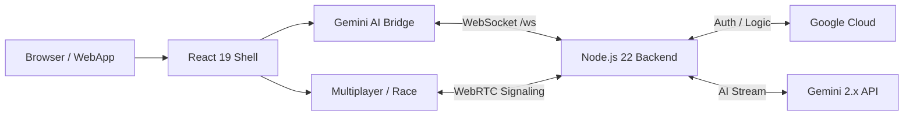

# AI Rubik's Tutor 2026

<div align="center">
  
  <h3>The future of 3D cognitive training, powered by Gemini 2.x Live.</h3>
  
  [](https://vitejs.dev)
  [](https://react.dev)
  [](https://tailwindcss.com)
  [](https://cloud.google.com/run)
  [](https://deepmind.google/technologies/gemini/)
</div>

---

## 🚀 One Repo. Two Intelligent Worlds.

AI Rubik's Tutor is a unified 2026 workspace that bridges high-level AI coaching with low-level deterministic logic. It's built around **one modern frontend system** and **one Cloud Run backend**.

### 🎙️ Part 1: Gemini Live Tutor
> **Realtime 3x3 coaching with voice, vision, and memory.**
> A realtime 3x3 coaching engine. It sees your physical cube via webcam, listens to your questions, and guides you to victory with voice, move-specific hints, and a shared 3D stage.
- **Routes:** `/`, `/part-1`, `/part-1/live`, `/part-1/multiplayer`.

### 🧪 Part 2: Cubey Core 2x2 Lab
> **Deterministic cube logic and exact solving search.**
> A standalone 2x2 solver with one shared cube core, manual controls, and exact BFS, A*, and IDA* playback on a shared 24-sticker state model.
- **Routes:** `/part-2`, `/legacy-2x2-solver/index.html`.

---

## ✨ Engineering Masterpieces (2026 Edition)

| Feature | Engineering Spotlight | Technology |
| :--- | :--- | :--- |
| **Multimodal Core** | Real-time video frame streaming via WebSockets for state validation. | Gemini 2.5 Flash + WebRTC |
| **Instant Solver** | Lightning-fast IDA* solve path calculation. | High-Performance WASM |
| **Voice Interaction** | Low-latency PCM audio chunking for seamless "barge-in" conversations. | AudioWorklet + WebSocket |
| **PBR 3D Workspace** | Physically Based Rendering (PBR) for a hyper-realistic cube experience. | Three.js (Physically Correct) |
| **Battle-Hardened** | Production-grade security with rate-limiting, Helmet CSP, and Zod validation. | Express 5 + Zod 4 |

---

## 🏗️ Technical Architecture

AI Rubik's Tutor uses a **Single-Origin Deployment** model. The frontend is compiled into production chunks and served directly by the Express backend, ensuring zero CORS friction in production.



---

## 🛠️ The Modern Stack

### Frontend Architecture
- **Framework:** React 19 (Concurrent Rendering)
- **State System:** Zustand 5 (Atomic State Management)
- **Styling Engine:** Tailwind CSS 4 (Zero-runtime CSS)
- **Build System:** Vite 7 (Instant HMR & O(1) cold start)
- **3D Render:** Three.js 0.183 (Physical Material Engine)

### Backend Intelligence
- **Runtime:** Node.js 22 LTS (High-Performance V8)
- **Routing:** Express 5 (Asynchronous request handling)
- **Transport:** `ws` (High-performance WebSocket implementation)
- **Safety:** Zod 4 (Schema-first validation/runtime typing)
- **Security:** Helmet + express-rate-limit (Proactive protection)

---

## 🚦 Getting Started

### 1. Installation
```bash
npm ci --prefix backend
npm ci --prefix frontend
```

### 2. Environment Setup
```bash
cp .env.example .env
```

**Minimum Required Settings:**
```bash
GEMINI_API_KEY=AIza...
GEMINI_LIVE_MODEL=gemini-live-2.5-flash-preview
VITE_BACKEND_ORIGIN=http://localhost:8080
```

### 3. Launch
```bash
# Unified launch script
./scripts/start-gemini.sh
```

---

## 📦 Deployment

The project is optimized for **Google Cloud Run**. The `Dockerfile` handles multi-stage optimization:
1.  **Frontend Stage**: Building optimized JS/CSS chunks.
2.  **Backend Stage**: Bundling the Express server and statically serving the frontend assets.

```bash
# Deploy to GCP
./deploy.sh <PROJECT_ID>
```

---

<p align="center">
  Designed and Optimized by <b>Mangesh Raut</b>
</p>
