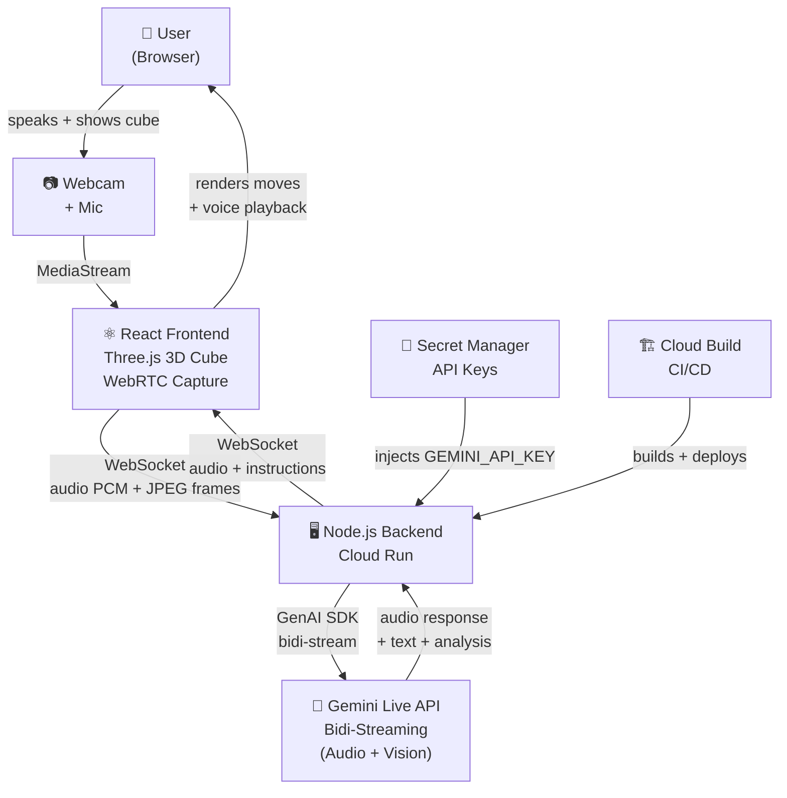

# Architecture Diagram

```mermaid
graph TB
    User["👤 User\n(Browser)"] 
    Webcam["📷 Webcam\n+ Mic"]
    Frontend["⚛️ React Frontend\nThree.js 3D Cube\nWebRTC Capture"]
    Backend["🖥️ Node.js Backend\nCloud Run"]
    GeminiLive["🤖 Gemini Live API\nBidi-Streaming\n(Audio + Vision)"]
    SecretMgr["🔐 Secret Manager\nAPI Keys"]
    CloudBuild["🏗️ Cloud Build\nCI/CD"]
    
    User -->|"speaks + shows cube"| Webcam
    Webcam -->|"MediaStream"| Frontend
    Frontend -->|"WebSocket\naudio PCM + JPEG frames"| Backend
    Backend -->|"GenAI SDK\nbidi-stream"| GeminiLive
    GeminiLive -->|"audio response\n+ text + analysis"| Backend
    Backend -->|"WebSocket\naudio + instructions"| Frontend
    Frontend -->|"renders moves\n+ voice playback"| User
    SecretMgr -->|"injects GEMINI_API_KEY"| Backend
    CloudBuild -->|"builds + deploys"| Backend
```
